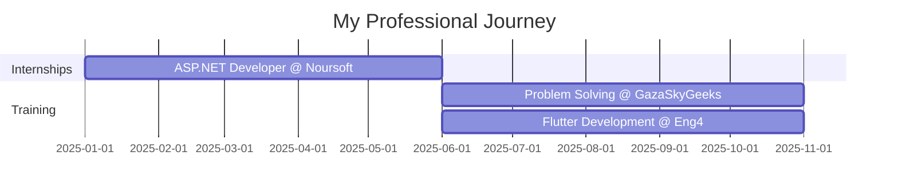

<div align="center">
  
</div>

<h3 align="center">🚀 Building the Future, One Line of Code at a Time</h3>

<p align="center">
  
  
</p>

---

### 👨‍💻 About Me

```typescript
const ezz = {
    location: "Palestine 🇵🇸",
    education: "Computer Engineering @ An-Najah National University",
    graduationYear: 2025,
    currentFocus: ["ASP.NET Core", "Flutter", "Problem Solving"],
    askMeAbout: ["Web Development", "Mobile Apps", "Backend APIs", "System Design"],
    funFact: "I turn coffee into code ☕ → 💻",
    contact: {
        email: "ezzmasre2002@gmail.com",
        phone: "+970598934419"
    }
};
```

---

### 🛠️ Tech Arsenal

<details open>
<summary><b>💻 Languages</b></summary>
<br/>


</details>

<details open>
<summary><b>🎨 Frontend</b></summary>
<br/>


</details>

<details open>
<summary><b>⚙️ Backend & Databases</b></summary>
<br/>


</details>

---

### 💼 Professional Experience



**🎯 Current Roles:**
- 💡 **Problem Solving** @ GazaSkyGeeks (June 2025 – Nov 2025)
- 📱 **Flutter Developer** @ Eng4 (June 2025 – Nov 2025)
- 🔧 **ASP.NET Developer Intern** @ Noursoft (Jan 2025 – June 2025)

---

### 🚀 Featured Projects

<table>
<tr>
<td width="50%">

#### 🎮 [PokemonReviewApp](https://github.com/ezzmasre/PokemonReviewApp)
**A comprehensive Pokémon management system**
- 🛠️ **Tech:** ASP.NET Core, SQL Server
- ✨ Complete CRUD operations
- 📊 Category organization system
- 👥 Owner & reviewer management
- 🌍 Country-based tracking

</td>
<td width="50%">

#### 📈 [StockCommentApp](https://github.com/ezzmasre/StockCommentApp)
**Stock Portfolio Management API**
- 🛠️ **Tech:** ASP.NET Core, SQL Server
- 🔐 JWT Authentication
- 👮 Role-based Authorization
- 📦 Repository Pattern
- 💬 Interactive Comment System

</td>
</tr>
<tr>
<td width="50%">

#### 🛒 [MarketApp](https://github.com/ezzmasre/MarketApp)
**Scalable Marketplace Platform**
- 🛠️ **Tech:** ASP.NET, MongoDB
- 📦 NoSQL Data Storage
- 🔄 Git Version Control
- ⚡ Flexible & Scalable Architecture

</td>
<td width="50%">

#### 🎓 More Projects Coming Soon!
Check out my repositories for more exciting projects and contributions.

[](https://github.com/ezzmasre?tab=repositories)

</td>
</tr>
</table>

---

### 📊 GitHub Statistics

<div align="center">
  
  
</div>

<div align="center">
  
  
</div>

---

### 🏆 GitHub Trophies

<div align="center">
  
</div>

---

### 🌐 Let's Connect!

<div align="center">
  
[](https://www.linkedin.com/in/ezz-masre-67b070342/)
[](mailto:ezzmasre2002@gmail.com)
[](https://www.instagram.com/ezzmasre1/)
[](https://github.com/ezzmasre)

</div>

---

### 💭 Random Dev Quote

<div align="center">
  


</div>

---

### 🐍 Contribution Snake

<div align="center">
  
</div>

---

<div align="center">
  
### 💡 *"Code is like humor. When you have to explain it, it's bad."* – Cory House

**⭐ From [ezzmasre](https://github.com/ezzmasre) | Made with 💜 and lots of ☕**

</div>
